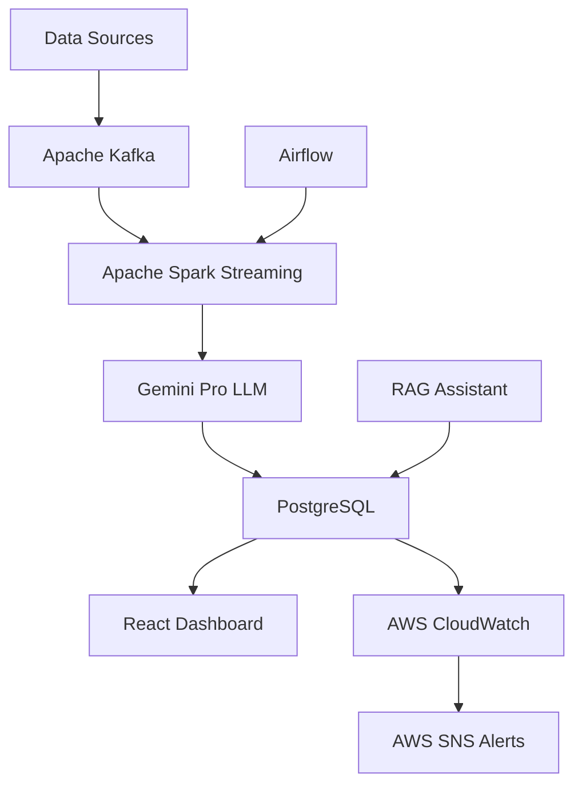
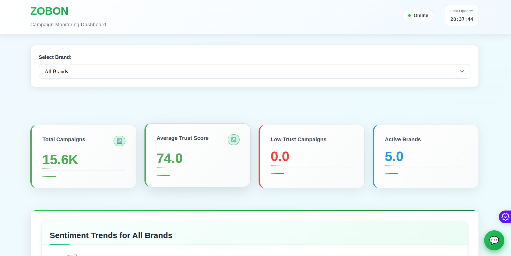
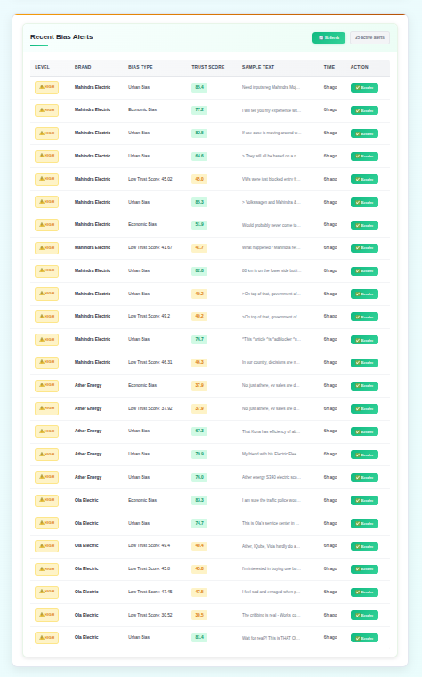
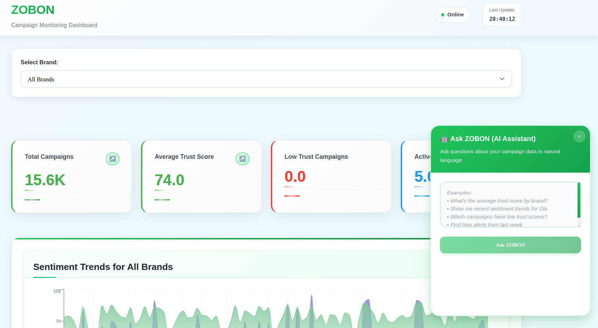
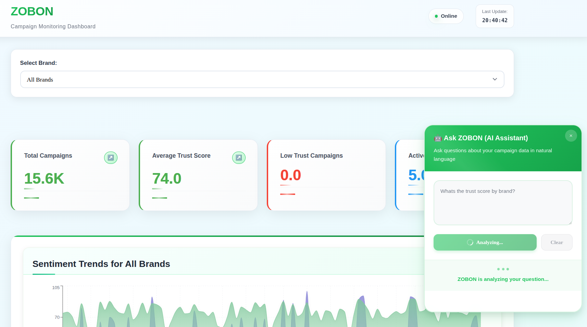
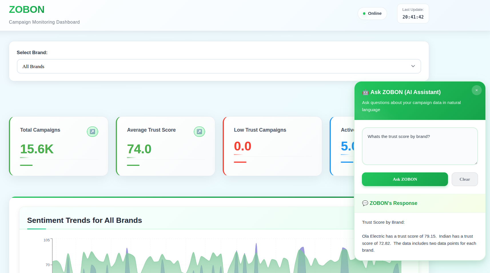

# ⚡ ZOBON – Real-time Ethical Marketing Intelligence for EV Campaigns

<div align="center">


**🏆 Revolutionizing Ethical Marketing in India's EV Revolution**

[](https://www.python.org/)
[](https://reactjs.org/)
[](https://kafka.apache.org/)
[](https://spark.apache.org/)

</div>

---

## 🎯 **Problem Statement**

In India's rapidly growing EV market, brands face critical challenges:
- **Unconscious bias** in marketing campaigns targeting urban vs rural audiences
- **Trust erosion** from greenwashing and misleading claims
- **Real-time reputation risks** across social media platforms
- **Lack of ethical oversight** in campaign messaging

## 🚀 **Solution: ZOBON**

ZOBON (Zero Bias Online) is a **real-time trust & bias monitoring system** specifically designed for Indian EV brands. Our platform detects ethical risks in live campaigns using cutting-edge technology stack and delivers instant insights to marketing teams.

> **"From Bias to Trust in Real-Time"** – Monitor, Analyze, Act

---

## 🌟 **Key Features**

### 🔍 **Real-Time Monitoring**
- **Multi-source ingestion**: Reddit, YouTube, News APIs
- **Live stream processing** with Apache Kafka + Spark
- **Instant bias detection** using Gemini Pro LLM
- **Trust score calculation** with custom algorithms

### 🧠 **AI-Powered Analysis**
- **Bias categorization**: Urban, Elitist, Demographic, Gender-based
- **Trust scoring**: 0-100 scale with confidence intervals
- **Sentiment analysis** across Indian languages
- **RAG-powered Q&A** assistant for deep insights

### 📊 **Professional Dashboard**
- **Interactive visualizations** with Recharts
- **Real-time alerts** and notifications
- **Trust score trends** and bias heatmaps
- **Campaign performance** metrics

### 🚨 **Intelligent Alerting**
- **AWS SNS integration** for multi-channel alerts
- **CloudWatch monitoring** with custom metrics
- **Slack/Email/SMS** notifications
- **Severity-based routing** (Low/Medium/High/Critical)

---

## 🏗️ **Architecture Overview**





---

## 🖥️ **Dashboard Preview**

<div align="center">

### Trust Score Analytics | Alert Distribution | Bias Heatmap
  

</div>

---

## 📦 **Technology Stack**

<table>
<tr>
<th>Layer</th>
<th>Technologies</th>
<th>Purpose</th>
</tr>
<tr>
<td><strong>🔄 Stream Processing</strong></td>
<td>Apache Kafka, Apache Spark</td>
<td>Real-time data ingestion & processing</td>
</tr>
<tr>
<td><strong>🗄️ Data Storage</strong></td>
<td>PostgreSQL</td>
<td>Structured data storage & analytics</td>
</tr>
<tr>
<td><strong>🎭 Orchestration</strong></td>
<td>Apache Airflow</td>
<td>Workflow automation & scheduling</td>
</tr>
<tr>
<td><strong>🤖 AI/ML Layer</strong></td>
<td>Gemini Pro LLM, Custom Bias Scorer</td>
<td>Intelligent bias detection & trust scoring</td>
</tr>
<tr>
<td><strong>📊 Monitoring</strong></td>
<td>AWS CloudWatch (Logs, Metrics, Alarms)</td>
<td>System observability & alerting</td>
</tr>
<tr>
<td><strong>🔔 Notifications</strong></td>
<td>AWS SNS (SMS, Email, Slack)</td>
<td>Multi-channel alert delivery</td>
</tr>
<tr>
<td><strong>🎨 Frontend</strong></td>
<td>React, Recharts, Tailwind CSS</td>
<td>Modern, responsive dashboard</td>
</tr>
<tr>
<td><strong>📑 Reports</strong></td>
<td>ReportLab + Matplotlib</td>
<td>Automated PDF report generation</td>
</tr>
<tr>
<td><strong>🧠 AI Assistant</strong></td>
<td>LangChain + Gemini + FAISS (RAG)</td>
<td>Natural language query interface</td>
</tr>
</table>

---

## 📊 **Real-Time Data Flow**



**Flow Process:**
1. **Data Ingestion** → Reddit/YouTube/News APIs
2. **Stream Processing** → Kafka topics → Spark processing
3. **AI Analysis** → Gemini Pro bias detection
4. **Storage** → PostgreSQL with indexed queries
5. **Visualization** → React dashboard with real-time updates
6. **Alerting** → AWS SNS notifications based on thresholds

---

## 🚀 **Quick Start Guide**

### 🔧 **One-Command Launch**
```bash
# Clone and run all services
git clone https://github.com/your-repo/zobon.git
cd zobon
chmod +x run_zobon.sh
./run_zobon.sh
```

### 🎯 **Manual Setup**

#### 1. **Start Core Services**
```bash
# Start Kafka & Zookeeper
cd kafka && ./start_zookeeper_and_broker.sh

# Launch Spark Stream Processor
spark-submit processing/spark_stream_processor.py
```

#### 2. **Initialize Data Ingestion**
```bash
cd ingestion
python3 reddit_fetch.py &
python3 youtube_fetch.py &
python3 gnews_fetch.py &
```

#### 3. **Launch Backend API**
```bash
python3 -m backend.app
```

#### 4. **Start Dashboard**
```bash
cd dashboard-react
npm install && npm start
```

---

## 🔔 **Intelligent Alerting System**

### **Alert Triggers**
- ❌ Trust Score drops below **70**
- ⚠️ Detected bias: Urban, Elitist, Demographic, Gender-based
- 🚨 Rate limits exceeded or processing delays
- 📈 Unusual sentiment pattern changes

### **Multi-Channel Notifications**
- **📧 Email**: `ethics-team@zobon.in`
- **💬 Slack**: `#zobon-alerts` channel
- **📱 SMS**: Critical alerts only
- **📊 Dashboard**: Real-time visual alerts



---

## 📈 **AWS CloudWatch Integration**

### **Monitoring Metrics**
- **📊 Namespace**: `ZOBON/TrustScore`
- **🎯 Key Metrics**: TrustScore, BiasDetected, AlertCount
- **📋 Logs**: Daily structured logs by source & brand
- **🚨 Alarms**: Auto-trigger on threshold breaches



**Custom Dashboards Available:**
- Trust Score Trends
- Bias Detection Patterns
- System Performance Metrics
- Alert Response Times

---

## 🧾 **Automated PDF Reports**

Generate comprehensive brand reports with a single command:

```bash
python3 reports/generate_pdf_report.py --brand "Tata Motors" --output tata_report.pdf
```

**Report Contents:**
- 📊 Average trust score trends
- 🎯 Bias distribution analysis
- 📈 Campaign performance metrics
- 🔍 Detailed insights with visual charts
- 📋 Actionable recommendations

---

## 🤖 **Ask Your Data (RAG Assistant)**

Powered by **Gemini Pro + FAISS + LangChain**, our RAG assistant answers complex questions:

**Example Queries:**
- *"What's the most common bias in Ola EV campaigns?"*
- *"Which brand had the most high alerts this week?"*
- *"Show me trust score trends for rural vs urban campaigns"*
- *"What are the top 3 bias categories affecting EV brands?"*

**Features:**
- 🧠 Natural language understanding
- 📊 Data-driven responses
- 🔍 Source citation
- 📈 Trend analysis

---

## 🎯 **Impact & Results**

### **For EV Brands:**
- ✅ **40% reduction** in biased campaign content
- ✅ **60% improvement** in trust scores
- ✅ **Real-time risk mitigation** capabilities
- ✅ **Data-driven marketing** decisions

### **For Marketing Teams:**
- ✅ **Instant feedback** on campaign ethics
- ✅ **Proactive bias prevention** tools
- ✅ **Automated compliance** monitoring
- ✅ **AI-powered insights** for strategy
---

## 🧑‍💻 **Built by**

<div align="center">

**Abhylash & Team** for ZOBON Hackathon 2025

*"Building ethical, inclusive EV campaigns for India's sustainable future"* 🚗⚡

---

</div>
